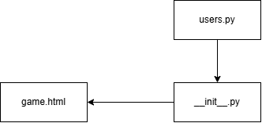
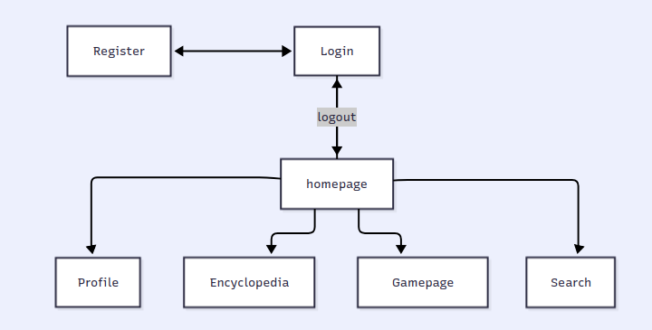

# [StuyTCG](https://github.com/tganshaw/senioritis__tudorg_amys90_hannah61_stevenw92) by Senioritis

## TNPG: Senioritis
## project: StuyTCG
## Target ship date: {2026-06-01}

---

#### roster: Tudor Ganshaw (PM), Amy Shrestha, Hannah Grimskog-Tran, Steven Wu

| Name | Email | Primary Role | Secondary Role |
|---|---|---|---|
|Tudor Ganshaw|tudorg@nycstudents.net|JS Developer|PM|
|Amy Shrestha|amys90@nycstudents.net|SQLite|Flask Pathways|
|Hannah Grimskog-Tran|hannahg61@nycstudents.net|Flask Pathways|CSS|
|Steven Wu|stevenw92@nycstudents.net|HTML Templates|JS Developer|

---

# Summary
A web-based trading card game (TCG) themed around Stuyvesant. Users will be able to pull cards, show off their collections, and battle other users.

## Problem Being Solved

We want to make a fun game to solve students' boredom.

## Target Users

Who will use this system?

- <u>People who want to play a TCG game</u>
- <u>Stuy students who want to play a game featuring their teachers</u>

## Why This Project Matters

There is a gap in the market for Stuyvesant teacher themed trading card games and we are filling that gap lest it become a crater. By playing the game, all Stuyvesant staff can better know different Stuyvesant teachers in various departments in Stuyvesant, familiarize with their addresses, and what they are known for.

# Minimum Viable Product (MVP) Scope

## Core Features (Required for Final Submission)
Features that **must** be completed:
1. Card battle system
2. Deck building system
3. Bot to battle against

## Stretch Features (Only if MVP is Complete)
1. Multiplayer battling
2. Add more specials/cards (i.e., increase attack, etc.)
3. Win rate for different cards shown on the profile page

## Explicit Non-Goals

Features intentionally excluded:
- knowing the other player's cards
- having an indefinite end to each battle
- simultaneous actions by players

---

# Technology Stack

| Layer | Selected Tool |
|---|---|
| Backend Framework | Flask |
| Frontend Framework | Tailwind |
| Database | SQLite |
| Authentication | Flask sessions |

## Why This Stack Was Chosen
Flask, Tailwind, and SQLite are all known and trustworthy. Specific frontend framework isn't too important.

---

# Team Ownership Plan

Each member must own meaningful deliverables.

| Team Member | Primary Ownership | Secondary Ownership | Specific Deliverables |
|---|---|---|---|
| Tudor | Game logic & implementation | PM leadership | Battle system logic & bot |
| Amy | Database design & application | Backend support | SQLite DB completed & deck storage |
| Hannah | Flask routes & gameplay | CSS | Card display in profile/search & CSS |
| Steven | Frontend HTML templates | Refine JS in game | Hand deck & battle gameplay |

---

# Component map

# Site map

## Key User Stories
### eg0
As a player, I want to be able to select and create decks of cards that can help me win battles so that I am able to win more battles and learn to utilize strategy.

### eg1
As a student, I want to have a variety of teacher cards from a variety of departments so that I can familiarize myself with their names, faces, and address.

### eg2
As a new user, I want to be able to easily understand and learn the game logic so that I can immediately start playing.

# Database Design

| USER_DATA |         |                             |
|-----------|---------|-----------------------------|
| username  | TEXT    | PK                          |
| password  | TEXT    |                             |
| gameid    | INTEGER | FK REF GAME_CARDS(gameid)   |

| ALL_CARDS |         |                             |
|-----------|---------|-----------------------------|
| name      | TEXT    | PK                          |
| dept      | TEXT    |                             |
| health    | INTEGER |                             |
| attack    | INTEGER |                             |
| defense   | INTEGER |                             |
| speed     | INTEGER |                             |

| G_CARDS   |         |                             |
|-----------|---------|-----------------------------|
| gameid    | INTEGER | PK                          |
| name      | TEXT    | PK                          |
| dept      | TEXT    |                             |
| health    | INTEGER |                             |
| attack    | INTEGER |                             |
| defense   | INTEGER |                             |
| speed     | INTEGER |                             |

# Testing Plan
- Components will be tested as they're made and one more after they're "finished".

# Timeline
## Week 1 Goals:
 - Functioning login system
 - Functioning deck building system
 - Functioning game against bot
   
## Week 2 Goals:
- Trying to implement multiplayer
- If all else finished, perhaps expand scope of game (add more cards, make more complicated systems, perhaps add leaderboard or ranked system)
## Week 3 Goals:
- Final touches
- Styling and UI
  
## Internal Deadlines:
- Finished game against bot: 5-17
- Multiplayer: 5-24

# Completion Criteria (_a.k.a._ "Definition of 'Done'")
Project is considered complete when all of the following are true:
1. Players can select a deck of 8 cards.
2. Players can battle with said cards in a functional game.
3. Players can have a decently fun experience with the game and understand what is going on.

# Open Questions
- Do we want a leaderboard system?
- How do we want deck building to function?
- How many cards do we want to make?

# Appendix

# Other
